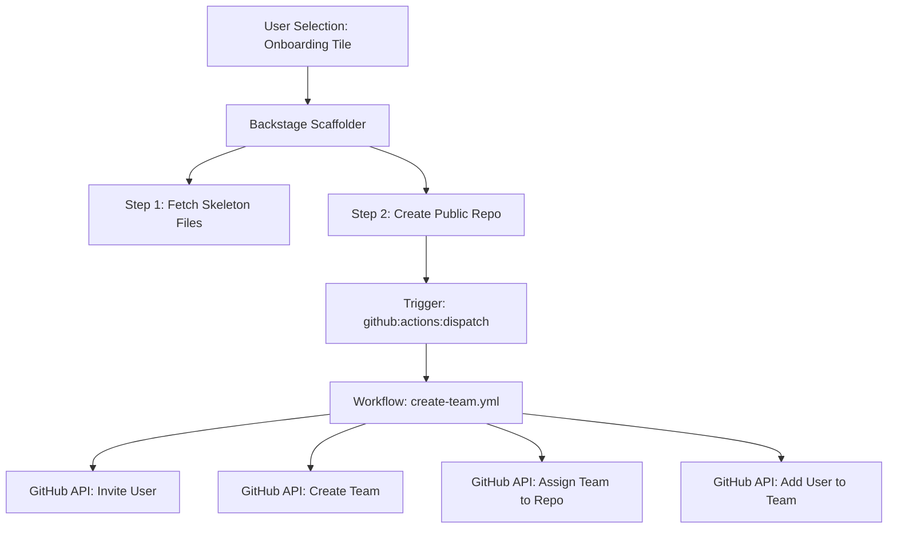

# [Backstage](https://backstage.io)

This is your newly scaffolded Backstage App, Good Luck!

To start the app, run:

```sh
yarn install
yarn start
```

# 🧩 🏗️ Organization Onboarding Workflow

## 🎯 Objective
Automate GitHub onboarding for the **quantum-lab-x** organization using **Backstage** and **GitHub Actions**.

---

## 🔄 End-to-End Flow
> **User** → **Backstage Template** → **GitHub Repo Creation** → **GitHub Actions** → **Org Setup**

### 📊 Visual Workflow (Architecture)



🚀 **Step-by-Step Execution**

### 1️⃣ User Triggers Onboarding
The user selects the **“Onboard User to Org”** tile in the Backstage UI.

* **GitHub Username**: The individual to be invited.
* **Repository Name**: The target project repository.
* **Team Name**: The specific GitHub team to manage the repo.

### 2️⃣ Backstage Scaffolder Executes Template
* **Step A (Fetch): Loads configuration from onboarding-skeleton/ and injects variables like githubUser.

* **Step B (Publish): Creates the repository quantum-lab-x/<repoName> with repoVisibility: public.

### 3️⃣ CODEOWNERS Applied Automatically
The template automatically generates the .github/CODEOWNERS file during the push:

* **Path: .github/CODEOWNERS
* **Content: * @quantum-lab-x/{{ values.teamName }}

### 4️⃣ Trigger GitHub Actions Automation
Backstage uses the github:actions:dispatch action to trigger the create-team.yml workflow.

* ** Target Repo: quantum-lab-x/platform-automation
* ** Event: workflow_dispatch

### 5️⃣ GitHub Actions Executes Org-Level Automation
Using the ORG_ADMIN_TOKEN stored as an Org Secret, the workflow executes:

* ** Invite User: Sends an official invitation to the organization.
* ** Create Team: Provisions the team quantum-lab-x/<teamName>.
* ** Add Member: Assigns the user to the new team.
* ** Grant Access: Links the team to the new repository with Push permissions.

✅ Final Automated State

---

## ✅ Final Automated State

| Component | Status | Description |
| :--- | :--- | :--- |
| **Repository** | ✅ Created | Hosted under quantum-lab-x |
| **Team** | ✅ Created | Dynamic name based on input |
| **User** | ✅ Invited | Official Org invitation sent |
| **Membership** | ✅ Added | User added to the new team |
| **Repo Access** | ✅ Granted | Team has write access to repo |

---
