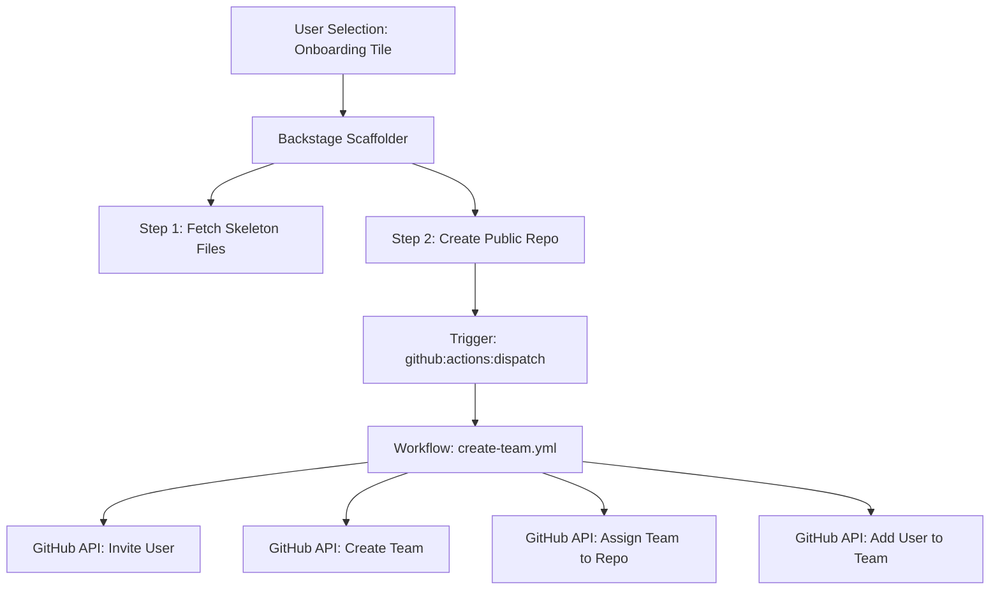

# [Backstage](https://backstage.io)

This is your newly scaffolded Backstage App, Good Luck!

To start the app, run:

```sh
yarn install
yarn start
```

# 🧩 🏗️ Organization Onboarding Workflow

## 🎯 Objective
Automate GitHub onboarding for the **quantum-lab-x** organization using **Backstage** and **GitHub Actions**.

---

## 🔄 End-to-End Flow
> **User** → **Backstage Template** → **GitHub Repo Creation** → **GitHub Actions** → **Org Setup**

### 📊 Visual Workflow (Architecture)



🚀 Step-by-Step Execution
1️⃣ User Triggers Onboarding
The user selects the “Onboard User to Org” tile in Backstage.

**Inputs: GitHub Username, Repository Name, and Team Name.
